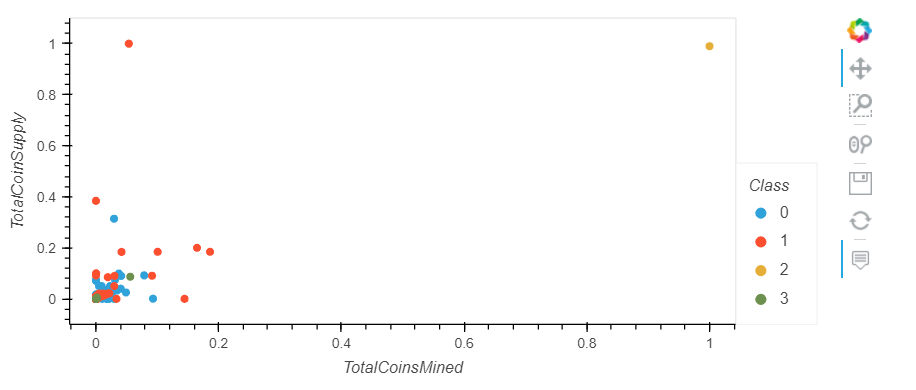

# Cryptocurrencies Analysis

## Purpose of the Analysis
The purpose of this project is to analyze the cryptocurrency dataset (crypto_data.csv) and create a report that shows what cryptocurrencies are on the trading market and how they could be grouped to create a classification system for a new investment portfolio that is being offered by an investment bank for its customers.

## Overview of the Analysis
The analysis uses unsupervised machine learning to examine cryptocurrency data

The analysis was carried out in the following steps:
* The data was first preprocessed by cleaning, encoding, and scaling it to fit the machine learning model algorithm. 
* Using the preprocessed data, the Principal Component Analysis (PCA) algorithm was used to reduce the dimensions of the DataFrame to three principal components and place these dimensions in a new DataFrame, pcs_df.
* The K-means algorithm was then used to create an elbow curve using hvPlot to find the best value for K from the pcs_df DataFrame. The K-means algorithm was run to predict the K clusters for the cryptocurrencies’ data.

* Finally, the data was visualized using a 3D scatter plot. The data was also transformed for "Total Coin Supply" and "Total Coins Mined" to create a 2D scatter plot.

## Results

* The analysis shows that all cryptocurrencies can be grouped into four different classes (clusters): class = 0 (purple),  class = 1 (pink), class = 2 (orange), class = 3 (yellow).

* The tradeable cryptocurrencies in a 2D plot with Total Coin Supply versus Total Coin Mined for the four classes is also shown below. The cryptocurrency that had the highest supply and mined the highest was **BitTorrent** and belongs to class 2 (the data point on the top right of the figure shown below).
